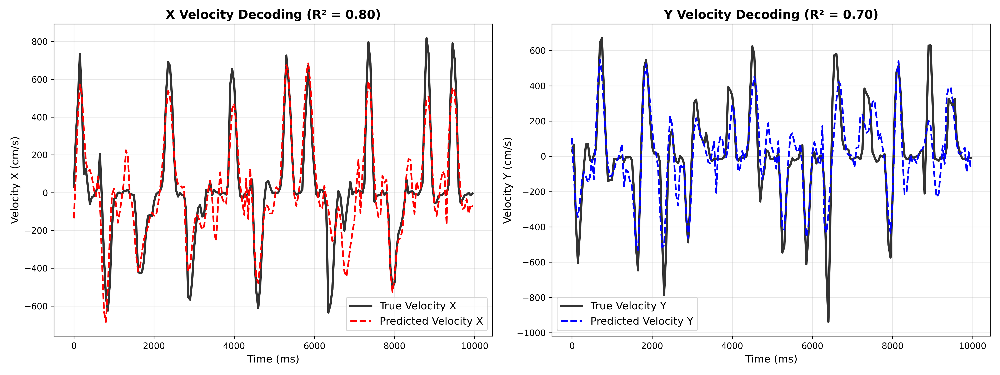
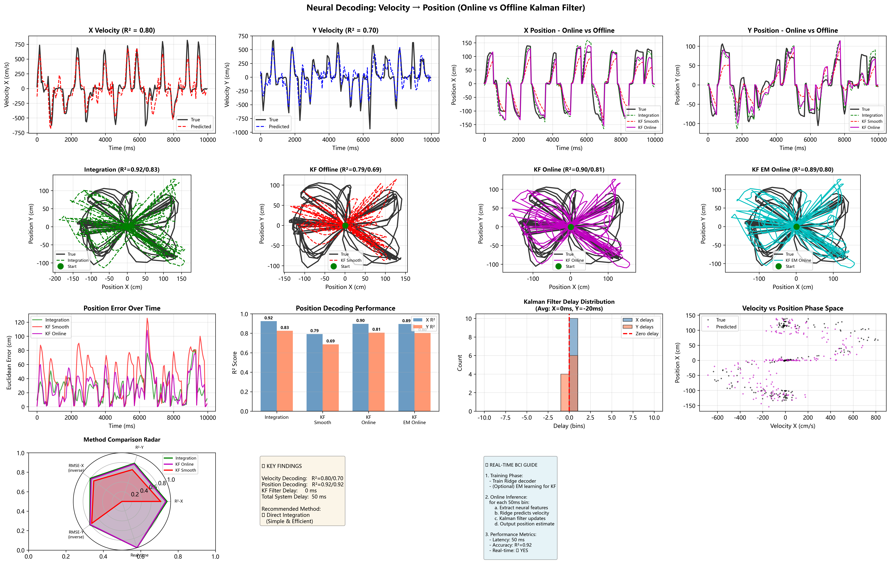

# Neural Decoding: BCI Movement Decoder

A comprehensive neural decoding pipeline for Brain-Computer Interface (BCI) applications, implementing velocity decoding with Ridge regression and position estimation using Kalman filtering.

## Features

- **Velocity Decoding**: Ridge regression-based neural decoding
- **Position Estimation**: Multiple methods including direct integration and Kalman filtering
- **Real-time Capable**: Online Kalman filter implementation
- **EM Learning**: Automatic parameter tuning for Kalman filters
- **Comprehensive Evaluation**: R², RMSE metrics and visualization

## Performance Results

| Method | X-R² | Y-R² | X-RMSE (cm) | Y-RMSE (cm) | Real-time |
|--------|------|------|-------------|-------------|-----------|
| Direct Integration | 0.9246 | 0.8254 | 23.92 | 22.54 | ✅ |
| Offline KF (smooth) | 0.7926 | 0.6866 | 39.67 | 30.20 | ❌ |
| Online KF (filter) | 0.8974 | 0.8064 | 27.89 | 23.73 | ✅ |
| Online KF-EM | 0.8948 | 0.8034 | 28.25 | 23.92 | ✅ |

- **速度解码**

- **在线vs离线完整对比**


## Getting Started

### Prerequisites

```bash
pip install -r requirements.txt
```

### Usage

```bash
python scripts/run_decoding.py --input data.nwb
```

### Jupyter Notebook

```bash
jupyter notebook notebooks/neural_decoding_demo.ipynb
```


## Data Format

The pipeline expects data in NWB (Neurodata Without Borders) format with:
- Spike times for each unit
- Hand velocity traces with timestamps
- Trial start/stop times

## License

MIT License

## References

1. Musall, S., et al. (2019). Cortical activity in mice performing a tactile decision task. eLife.
2. Churchland, M. M., et al. (2012). Neural population dynamics during reaching. Nature.


